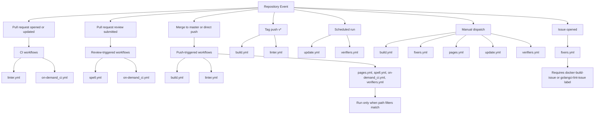

# Available workflows

This directory contains the GitHub Actions workflows used for CI validation,
maintenance, and repository automation.

## Quick context

- `CI:` workflows run on pull requests and/or pushes to validate code quality,
  execute tests, and gate publish steps.
- `Docs:` workflows focus on documentation quality and site delivery
  (spelling checks and GitHub Pages deployment).
- `Maintenance:` workflows run on schedules, manual dispatch, or issue events
  to automate upgrades, quality improvements, and assisted remediation.

In general, pull requests trigger validation workflows,
while merges to `master` trigger push-based workflows,
and scheduled/manual workflows handle recurring maintenance tasks.

## Execution map

The diagram below shows which workflow groups run at each repository event.
Use it as a quick orientation before reviewing the detailed table.

<!-- markdownlint-disable MD013 -->

| Workflow file                          | Purpose                                                                                                                                                                                                                                                                                                                          | Trigger                                                                                                                                                       |
| :------------------------------------- | :------------------------------------------------------------------------------------------------------------------------------------------------------------------------------------------------------------------------------------------------------------------------------------------------------------------------------- | :------------------------------------------------------------------------------------------------------------------------------------------------------------ |
| [build.yml](./build.yml)               | **CI: Build, Test, and Publish Image**. Detects relevant Go/Docker changes, runs Go unit tests, coverage, and mutation testing, then builds, validates, and publishes the image to `ghcr.io` only when all quality gates succeed. It can open an issue with AI-generated diagnostics when Docker build/runtime validation fails. | `workflow_dispatch`, `push` to `master` or `v*` tags                                                                                                          |
| [fixers.yml](./fixers.yml)             | **Maintenance: Automated Docker and Go Fixers**. Runs Copilot CLI remediation jobs for Docker build failures and `golangci-lint` findings and prepares pull requests with proposed fixes. Issue-triggered jobs run only when opened issues already include `docker-build-issue` or `golangci-lint-issue` labels.                 | `workflow_dispatch`, `issues` on `opened` when issue includes `docker-build-issue` or `golangci-lint-issue`                                                   |
| [linter.yml](./linter.yml)             | **CI: Lint and Static Checks**. Measures SLOC, validates documentation links, runs `super-linter`, and files an issue with AI-assisted analysis when linting fails.                                                                                                                                                              | `push`, `pull_request`                                                                                                                                        |
| [on-demand_ci.yml](./on-demand_ci.yml) | **CI: End-to-End Validation**. Validates shell script formatting and runs the functional self-hosted demo. It always exports and uploads Kind cluster logs for diagnostics.                                                                                                                                                      | `push` for `*.go` and `*.sh` changes outside `.github/**`, `pull_request` on `opened`, `synchronize`, or `reopened`, and `pull_request_review` on `submitted` |
| [pages.yml](./pages.yml)               | **Docs: Build and Deploy GitHub Pages**. Stages docs content, builds the Jekyll site, uploads artifacts, and deploys to GitHub Pages.                                                                                                                                                                                            | `workflow_dispatch`, `push` to `master` when `docs/**`, `ci/prepare_pages_site.py`, or `.github/workflows/pages.yml` change                                   |
| [spell.yml](./spell.yml)               | **Docs: Spelling Validation**. Verifies docs spelling using both `reviewdog/action-misspell` and `pyspelling`.                                                                                                                                                                                                                   | `push` for Markdown changes outside `.github/**`, `pull_request_review` on `submitted`                                                                        |
| [update.yml](./update.yml)             | **Maintenance: Scheduled Dependency Version Updates**. Runs automated version refresh commands and opens a pull request with updated managed version files.                                                                                                                                                                      | Weekly schedule (`0 0 * * 5`) and `workflow_dispatch`                                                                                                         |
| [verifiers.yml](./verifiers.yml)       | **Maintenance: Go Quality Verification and Improvements**. Runs `golangci-lint`, files issues with AI-generated analysis on failures, and on non-push runs launches janitor/QA Copilot tasks to reduce technical debt and improve code coverage through PRs.                                                                     | `push` for `*.go` changes, weekly schedule (`0 0 * * 5`), and `workflow_dispatch`                                                                             |

<!-- markdownlint-enable MD013 -->
