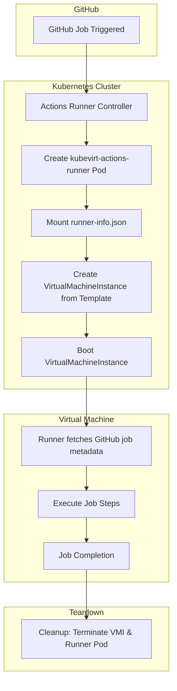

# Kubevirt Actions Runner

<!-- markdown-link-check-disable-next-line -->

<!-- markdown-link-check-disable-next-line -->

## Overview

`kubevirt-actions-runner` is a custom GitHub Actions runner image designed for use with the [Actions Runner Controller (ARC)](https://github.com/actions/actions-runner-controller).
This runner provisions ephemeral virtual machines (VMs) using [KubeVirt](https://kubevirt.io), extending the flexibility and security of your CI/CD workflows.

This is particularly useful for validating scenarios that are not supported by default GitHub-hosted runners, such as:

- Running Windows or macOS jobs
- Custom environments that require specific kernel modules or system services
- Jobs requiring strong isolation from the host system

## Key Features

- _Ephemeral VM creation_: Launch a fresh VM for every job and destroy it after completion
- _Increased isolation_: Ideal for untrusted code or complex system configurations
- Custom system-level configuration support
- Easily integrates with ARC and Kubernetes-native tooling

## Prerequisites

To use this project, ensure you have the following installed:

- A working Kubernetes cluster
- [Actions Runner Controller](https://github.com/actions/actions-runner-controller/blob/master/docs/quickstart.md)
- [KubeVirt](https://kubevirt.io/quickstart_cloud)

## Architecture Diagram

## Limitations

- _macOS support_: macOS virtualization is not supported via KubeVirt due to licensing constraints.
- _Long job durations_: Boot time of VMs may increase total runtime.
- _Persistent state_: Not designed for workflows requiring persisted state between jobs.

## Presentations

### KCD Guadalajara 2025 – Migrating GitHub Actions with Nested Virtualization to the Cloud-Native Ecosystem

This project was presented at [Kubernetes Community Days (KCD) Guadalajara 2025](https://community.cncf.io/events/details/cncf-kcd-guadalajara-presents-kcd-guadalajara-2025/cohost-kcd-guadalajara), showcasing how to extend GitHub Actions with KubeVirt and nested virtualization to support custom and complex CI/CD workflows in Kubernetes.

- [Video (Spanish)](https://www.youtube.com/watch?v=ccb8y_Ij30k)
- [Slides](https://www.slideshare.net/slideshow/migrating-github-actions-with-nested-virtualization-to-cloud-native-ecosystem-pptx/277448656)

The presentation walks through:

- Challenges with standard GitHub-hosted runners
- Benefits of using KubeVirt for GitHub Actions runners
- Live demo deploying and running jobs inside ephemeral VMs
- Lessons learned and architectural considerations
