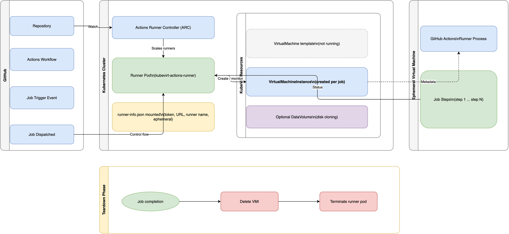

# Architecture Overview

This document provides an overview of the architecture used in the testbed for
`kubevirt-actions-runner`.

The runner pod receives GitHub Actions metadata,
creates a VirtualMachineInstance (VMI) from a predefined KubeVirt template,
waits until the job reaches a terminal state,
and then removes runtime resources.

## Components

- **kind**: Creates a local Kubernetes cluster running in Docker.
- **KubeVirt**: Enables VM workloads inside Kubernetes.
- **VM Template**: Cloned dynamically by the runner.
- **Demo Workload**: Validates VM lifecycle management.

## Deployment Flow

The following diagram describes the complete deployment,
runtime execution,
and teardown sequence.

## Related documentation

- For a guided first run,
  see the [Quickstart tutorial](../tutorials/quickstart.md).
- For operational setup tasks,
  see [How-to guides](../how-to-guides/index.md).
- For command and configuration details,
  see [Reference](../references/index.md).
