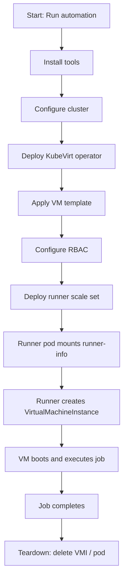

# Architecture Overview

This document provides an overview of the architecture used in the testbed for
`kubevirt-actions-runner`.

## Components

- **kind**: Creates a local Kubernetes cluster running in Docker.
- **KubeVirt**: Enables VM workloads inside Kubernetes.
- **VM Template**: Cloned dynamically by the runner.
- **Demo Workload**: Validates VM lifecycle management.

## Deployment Flow

The following flowchart describes the complete deployment and runtime sequence:

