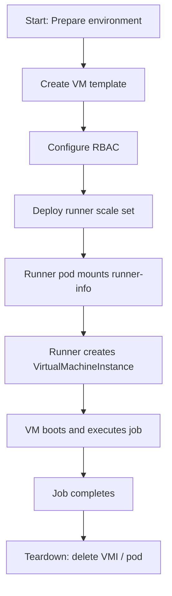

# Quick Start Guide

This guide provides step-by-step instructions to quickly set up and use the `kubevirt-actions-runner`.

## Goal

The objective of this guide is to enable you to deploy and configure the `kubevirt-actions-runner` for running GitHub Actions jobs on KubeVirt virtual machines.

## Prerequisites

Before proceeding, ensure you have the following:

- A working Kubernetes cluster
- [Actions Runner Controller](https://github.com/actions/actions-runner-controller/blob/master/docs/quickstart.md)
- [KubeVirt](https://kubevirt.io/quickstart_cloud)
- Basic knowledge of Kubernetes and Helm

## Deployment Flow

The following flowchart describes the complete deployment and runtime sequence:



## Steps

### 1. Create VirtualMachine Template

This template will be used to spawn VMs on-demand for each GitHub job. The base `VirtualMachine` will never be started; instead, clones of it will be launched as `VirtualMachineInstances`.

```bash
# Create namespace if it doesn't exist
kubectl get namespace "${namespace}" || kubectl create namespace "${namespace}"

# Apply the VM template
kubectl apply -f scripts/vm_template.yml -n "${namespace}"
```

Example snippet from [`vm.yaml`](../scripts/test-data/vm.yaml):

```yaml
apiVersion: kubevirt.io/v1
kind: VirtualMachine
metadata:
  name: ubuntu-jammy-vm
spec:
  runStrategy: Manual
  template:
    spec:
      domain:
        devices:
          filesystems:
            - name: runner-info
              virtiofs: {}
```

The `runner-info` volume is mounted at runtime and contains metadata required by the GitHub Actions runner, e.g.:

```json
{
  "name": "runner-abcde-abcde",
  "token": "AAAAAAAAAAAAAAAAAAAAAAAAAAAAA",
  "url": "https://github.com/org/repo",
  "ephemeral": true,
  "groups": "",
  "labels": ""
}
```

### 2. Configure RBAC for KubeVirt Access

The service account used by the runner pods must be granted permissions to manage KubeVirt VMs.

```yaml
apiVersion: v1
kind: ServiceAccount
metadata:
  name: kubevirt-actions-runner
---
apiVersion: rbac.authorization.k8s.io/v1
kind: Role
metadata:
  name: kubevirt-actions-runner
rules:
  - apiGroups: ["kubevirt.io"]
    resources: ["virtualmachines"]
    verbs: ["get", "watch", "list"]
  - apiGroups: ["kubevirt.io"]
    resources: ["virtualmachineinstances"]
    verbs: ["get", "watch", "list", "create", "delete"]
  - apiGroups: ["cdi.kubevirt.io"]
    resources: ["datavolumes"]
    verbs: ["get", "watch", "list", "create", "delete"]
---
apiVersion: rbac.authorization.k8s.io/v1
kind: ClusterRole
metadata:
  name: cdi-cloner
rules:
  - apiGroups: ["cdi.kubevirt.io"]
    resources: ["datavolumes/source"]
    verbs: ["create"]
```

### 3. Deploy the Runner Scale Set

Use Helm to install the GitHub Actions runner scale set.

Create a `values.yml` file:

```yaml
githubConfigUrl: https://github.com/<your_enterprise/org/repo>
githubConfigSecret: <your_github_secret>

template:
  spec:
    serviceAccountName: kubevirt-actions-runner
    containers:
      - name: runner
        image: electrocucaracha/kubevirt-actions-runner:latest
        command: []
        env:
          - name: KUBEVIRT_VM_TEMPLATE
            value: ubuntu-jammy-vm
          - name: RUNNER_NAME
            valueFrom:
              fieldRef:
                fieldPath: metadata.name
```

Install using Helm:

```bash
helm upgrade --create-namespace --namespace "${namespace}" \
    --wait --install --values values.yml vm-self-hosted \
    oci://ghcr.io/actions/actions-runner-controller-charts/gha-runner-scale-set
```

## Verification

You can manually inspect cluster resources to confirm correct behavior:

```bash
kubectl get pods -A
kubectl get vms -A
kubectl get vmis -A
```

Inspect runner logs for job output and lifecycle events:

```bash
kubectl logs <runner-pod> -n <your-namespace>
```

To inspect a specific VMI and recent events:

```bash
kubectl describe vmi <vmi-name> -n <your-namespace>
kubectl get events -n <your-namespace>
```

## Next Steps

- Customize the VM template to match workload and image requirements.
- Integrate telemetry as described in the [Telemetry Guide](how-to-enable-telemetry.md).
- Set up a local test environment using the [Testbed Guide](how-to-setup-testbed.md).
