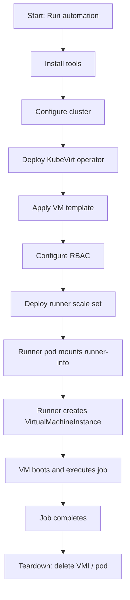

# How to Set Up a Testing Environment for kubevirt-actions-runner

## Goal

This guide explains how to configure a local test environment for validating `kubevirt-actions-runner`.

The objective is to provision a lightweight Kubernetes cluster capable of running virtual machines via KubeVirt and verify the full execution flow:

Runner Pod → VirtualMachineInstance → VM Boot → Job Execution → Cleanup

> Note: The environment created by this guide is intended for functional testing and development, not production use.

## Prerequisites

Ensure the following requirements are met:

- A Linux distribution installed (bare metal or VM)
- Bash 3+
- A passwordless sudo account
- Internet access (to download dependencies and container images)

## Architecture Overview

This testbed uses:

- `kind` to create a local Kubernetes cluster running in Docker.
- KubeVirt to enable VM workloads inside Kubernetes.
- A VM template that is cloned dynamically by the runner.
- A demo workload to validate VM lifecycle management.

## Deployment Flow

The following flowchart describes the complete deployment and runtime sequence:



## Automated install

The [`main.sh` script](../scripts/main.sh) orchestrates the full setup:

- Tool installation
- Kubernetes cluster creation
- KubeVirt deployment
- VM template registration

```bash { name=how-to-deploy.main}
cd scripts
./main.sh
```

### What the automation does

- Install tools: runs [`install.sh`](../scripts/install.sh).
  - Installs `kind`, `kubectl`, `docker`, `go` and `helm` when they are not present.

- Configure cluster: runs [`configure.sh`](../scripts/configure.sh).
  - Creates a local Kubernetes cluster with `kind` (if it does not already exist).
  - Installs the KubeVirt operator and required components.
  - Applies [a runner VM template ](../scripts/test-data/vm.yaml) used by the scripts.
    That template is an example base object the runner clones into
    ephemeral `VirtualMachineInstance` (VMI) objects when processing jobs.

## Run the demo

The repository includes `scripts/demo.sh`. It simulates a job that
triggers the runner to create a small VMI and run a simple workload.

```bash { name=how-to-deploy.demo}
cd scripts
bash ./demo.sh
```

This confirms that:

- The runner has proper RBAC
- KubeVirt is functioning
- VM creation and teardown work correctly

## Verification

You can manually inspect cluster resources to confirm correct behavior.

```bash
kubectl get pods -A
kubectl get vms -A
kubectl get vmis -A
```

Inspect runner logs for job output and lifecycle events:

```bash
kubectl logs <runner-pod> -n <your-namespace>
```

To inspect a specific VMI and recent events:

```bash
kubectl describe vmi <vmi-name> -n <your-namespace>
kubectl get events -n <your-namespace>
```

## Next steps

- Customize the VM template to match workload and image
  requirements. Replace emulation with hardware virtualization (KVM) for better performance.
- Harden RBAC and Helm values for production environments.
- Adjust Helm values for production environments.
