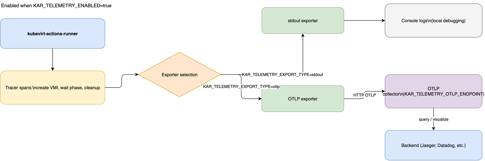
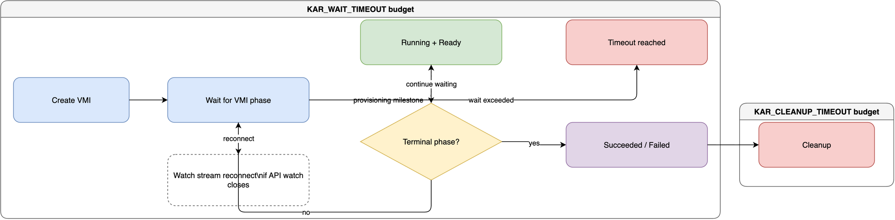

# Configuration reference

`kubevirt-actions-runner` reads runtime configuration from environment variables.
This page lists supported variables,
their defaults,
and accepted values.

## Timeout configuration

| Variable              | Default  | Description                                                         |
| --------------------- | -------- | ------------------------------------------------------------------- |
| `KAR_WAIT_TIMEOUT`    | `1h0m0s` | Maximum wait time for terminal VMI phases (`Succeeded` or `Failed`) |
| `KAR_CLEANUP_TIMEOUT` | `5m0s`   | Maximum time allotted to resource cleanup                           |

`KAR_WAIT_TIMEOUT` and `KAR_CLEANUP_TIMEOUT` accept
[Go duration](https://pkg.go.dev/time#ParseDuration)
format,
for example `90s`, `15m`, or `2h`.
If a value is invalid,
the default is used.

## Telemetry configuration

| Variable                        | Default                   | Description                                     |
| ------------------------------- | ------------------------- | ----------------------------------------------- |
| `KAR_TELEMETRY_ENABLED`         | `false`                   | Enables telemetry when set to `true`            |
| `KAR_TELEMETRY_EXPORT_TYPE`     | empty                     | Exporter type: `otlp` or `stdout`               |
| `KAR_TELEMETRY_OTLP_ENDPOINT`   | `http://localhost:4318`   | HTTP endpoint for OpenTelemetry Protocol export |
| `KAR_TELEMETRY_SERVICE_NAME`    | `kubevirt-actions-runner` | Telemetry service name                          |
| `KAR_TELEMETRY_SERVICE_VERSION` | `unknown`                 | Telemetry service version                       |

## Logging configuration

| Variable        | Default | Description                                   |
| --------------- | ------- | --------------------------------------------- |
| `KAR_LOG_LEVEL` | `info`  | Log verbosity level used by the runner logger |

## Runner input configuration

These variables map to CLI flags and are commonly injected by the runner Pod spec.

| Variable                         | Default       | Description                                                         |
| -------------------------------- | ------------- | ------------------------------------------------------------------- |
| `KUBEVIRT_VM_TEMPLATE`           | `vm-template` | VirtualMachine template name used to create VirtualMachineInstances |
| `KUBEVIRT_VM_TEMPLATE_NAMESPACE` | `default`     | Namespace where the VirtualMachine template exists                  |
| `RUNNER_NAME`                    | `runner`      | Runner name used for generated resources                            |
| `ACTIONS_RUNNER_INPUT_JITCONFIG` | empty         | Opaque just-in-time runner configuration payload                    |

Use `KUBEVIRT_VM_TEMPLATE_NAMESPACE` when you keep templates in a dedicated namespace.
This enables a single golden template strategy,
so multiple runner namespaces can clone from one controlled source
without duplicating template objects.

## Related guides

- To configure telemetry in practice,
  see [Enable telemetry](../how-to-guides/enable-telemetry.md).
- To tune timeout behavior,
  see [Configure runner timeouts](../how-to-guides/configure-timeouts.md).

## Visual references

- Telemetry export pipeline:
  
- Timeout and wait-loop behavior:
  
